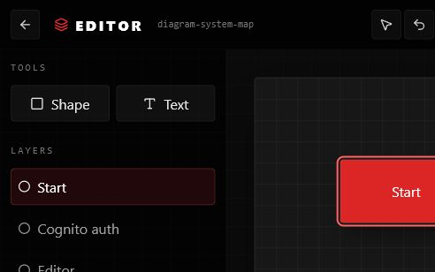

# Diagramify Mini

Diagramify Mini is an authenticated PlantUML workspace for creating, saving, previewing, importing, and exporting diagrams.

The application uses AWS Cognito for authentication, keeps diagrams behind a storage abstraction, and provides a split editor with a live PlantUML preview.



## Features

* AWS Cognito sign-up and sign-in
* Email verification flow
* Protected application routes
* User-scoped diagram dashboard
* Create, rename, edit, and delete diagrams
* PlantUML source editor
* Live SVG preview
* Automatic saving
* Manual save with `Ctrl/Cmd + S`
* Diagram zoom controls
* Import `.puml`, `.plantuml`, and `.txt` files
* Export PNG
* Export SVG
* Download PlantUML source
* Local diagram persistence through a storage abstraction

## Tech Stack

* React
* TypeScript
* Vite
* React Router
* Tailwind CSS
* AWS Cognito
* PlantUML
* Pako
* Docker
* GitHub Actions

## How It Works

```text
AWS Cognito
     │
     ▼
Authenticated React App
     │
     ├── Dashboard
     │      └── Diagram management
     │
     └── Editor
            ├── PlantUML source
            ├── Autosave
            ├── Live preview
            └── Import / export
                     │
                     ▼
                DiagramStore
                     │
                     ▼
                localStorage
```

The UI talks to a `DiagramStore` interface instead of directly coupling diagram management to browser storage.

The current implementation uses `localStorage`.

A future backend-backed store can implement the same interface without requiring the editor and dashboard to be redesigned.

## PlantUML Rendering

PlantUML source is compressed and encoded in the browser before being sent to the PlantUML rendering service.

The editor supports:

```text
PlantUML source
      │
      ├── SVG live preview
      ├── PNG export
      └── SVG export
```

## Privacy Note

The current version uses the public PlantUML server for rendering.

Do not use the public renderer for confidential or sensitive diagrams.

A self-hosted PlantUML server would be a safer option for private production workloads.

## Authentication

Authentication is handled through Amazon Cognito.

Create a `.env.local` file:

```env
VITE_COGNITO_USER_POOL_ID=your_user_pool_id
VITE_COGNITO_CLIENT_ID=your_app_client_id
VITE_COGNITO_REGION=your_region
```

The Cognito app client should be configured for a browser application without a client secret.

## Local Development

Install dependencies:

```bash
npm install
```

Start Vite:

```bash
npm run dev
```

Build:

```bash
npm run build
```

Validate:

```bash
npm run typecheck
npm run lint
```

## Docker

Build:

```bash
docker build -t diagramify-mini .
```

Run:

```bash
docker run --rm -p 4173:4173 diagramify-mini
```

Or use Docker Compose:

```bash
docker compose up --build
```

## Storage

The current store supports:

```text
list
get
create
rename
delete
save
```

Each operation is scoped by the authenticated user ID.

The storage interface is designed so another persistence layer can replace the current browser-backed implementation later.

## Project Structure

```text
src/
├── auth/
├── components/
├── diagrams/
│   ├── diagramStore.ts
│   ├── localDiagramStore.ts
│   └── types.ts
├── editor/
├── pages/
│   ├── DashboardPage.tsx
│   ├── EditorPage.tsx
│   └── LoginPage.tsx
└── routes/
```

## License

MIT
