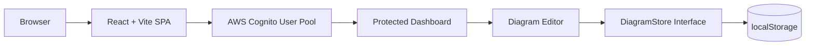
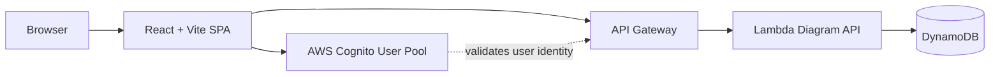

# Architecture

Diagramify Mini is a cloud-ready React, TypeScript, and Vite single-page app. The current implementation keeps the app small and free-tier safe while preserving a clean path to AWS-backed persistence later.

## Current Architecture



## Current Flow

```text
React/Vite -> Cognito -> Protected Dashboard -> Editor -> DiagramStore -> localStorage
```

1. The React/Vite app loads in the browser.
2. Cognito handles email/password sign-up, email confirmation, sign-in, session recovery, and sign-out.
3. Protected routes require an authenticated Cognito user before showing the dashboard.
4. The dashboard and editor read and write diagrams through the `DiagramStore` interface.
5. The current `localDiagramStore` implementation persists user diagrams in browser `localStorage`.

## Why The DiagramStore Interface Exists

`DiagramStore` separates application behavior from the persistence mechanism. The dashboard and editor do not need to know whether diagrams are stored in `localStorage`, DynamoDB, or another backend. They only call methods such as `list`, `get`, `create`, `rename`, `delete`, and `save`.

This boundary keeps the first version small while showing a production-minded architecture: persistence can change without rewriting the editor.

## Why localStorage Is Used First

`localStorage` is used first because this mini app is focused on demonstrating authentication, protected routes, editor state, persistence abstraction, Docker, CI, and AWS deployment planning without creating avoidable cloud costs.

This keeps the project free-tier safe during development and internship review. It also allows the app to be tested locally without deploying an API or database.

## Future AWS Architecture



## Future Flow

```text
React/Vite -> Cognito -> API Gateway -> Lambda -> DynamoDB
```

In a future version, the app can keep Cognito for authentication and replace `localDiagramStore` with a backend-backed implementation of the same `DiagramStore` contract. API Gateway would receive authenticated requests, Lambda would validate the user identity and perform diagram operations, and DynamoDB would store diagrams by user.

A possible DynamoDB key design is already noted in the code:

```text
PK USER#<userId>
SK DIAGRAM#<diagramId>
```

This lets each user list and update their own diagrams efficiently while keeping the data model simple.
